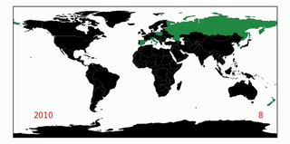

### Hi, I'm Asya! 👋

I'm an algorithm developer, specializing in computer vision. I love solving problems with code and learning new things.

### 💻 Tech stack
* 🐍 Python | C++ | Shell scripting | Typescript
* 🧠 Tensorflow | PyTorch | NumPy | SciPy | Pandas | Scikit-learn
* 🖼️ OpenCV | PIL
* :octocat: Git | Github
* ☁ AWS | GCP
* :floppy_disk: Linux | Windows | MacOS

### 📚 Interests
* Machine learning | Deep learning | MLOps
* Statistics
* Programming languages
* Image processing
* Maps and geographical data | Medical data
* Computer graphics

### 📊 Knowledge sharing
I give talks from time to time about my professional or personal Data Science projects. Some of them are uploaded to 
[youtube](https://www.youtube.com/playlist?list=PLytd8wshHHh9Tf53tyG58R3cpuwFChVzz).

I also write blog posts about my career and my projects. I publish them in my [Medium](https://medium.com/@asyafru) profile.

### ✈️⛺ Travelling
I'm an avid traveller and hiker. Travelling is an inspiration for some of my coding side-projects.

This gif sums my travels in the years 2010-2019:

### ✉️ How to reach me
* [Linkedin](https://www.linkedin.com/in/asya-frumkin/)
* [Twitter](https://twitter.com/asya_fru/)
* [Mail](mailto:asyafru@gmail.com)
